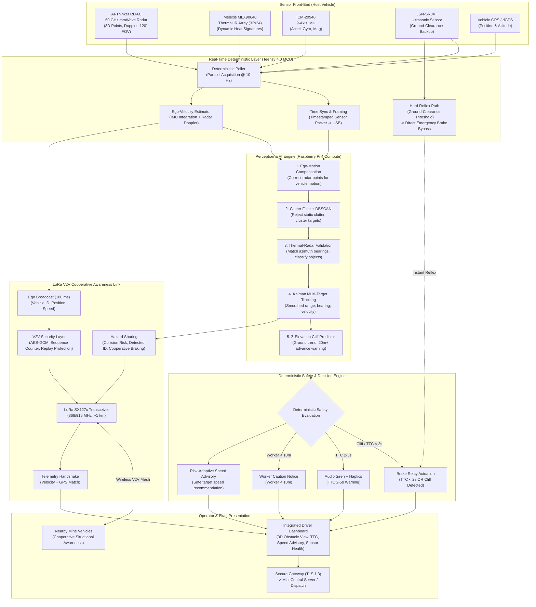
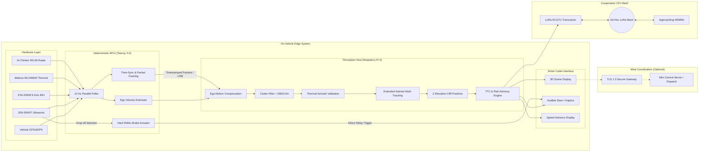
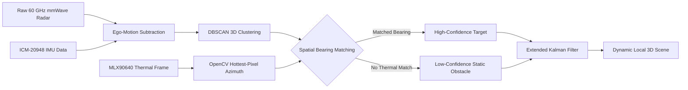
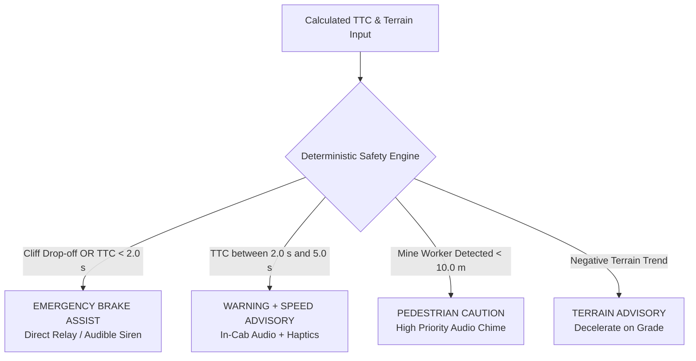
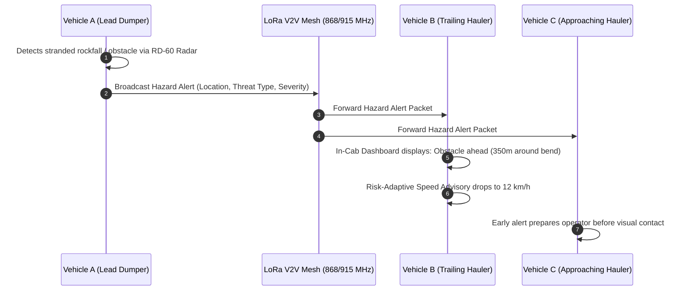

# MineSight

**Safe and Efficient Operation of Mine Vehicles in Fog and Low-Visibility Conditions in Open Cast Iron Ore Mines**

[](https://www.sih.gov.in/)
[](#problem-statement)
[](#overview)
[](#hardware-architecture)
[](#team)
[](#team)
[](LICENSE)

---

## Project Identity

| Attribute | Specification |
| :--- | :--- |
| **Project Name** | **MineSight** |
| **Event** | Smart India Hackathon (SIH) 2026 |
| **Problem Statement ID** | **26007** |
| **Problem Statement Title** | Safe and Efficient Operation of Mine Vehicles in Fog and Low-Visibility Conditions in Open Cast Iron Ore Mines |
| **Theme** | Smart Automation |
| **Category** | Hardware |
| **Team Name** | Lost in transmission |
| **Team ID** | 176278 |

---

## 1. Overview

**MineSight** is an edge-computed multi-sensor situational awareness and vehicle safety system engineered for heavy earth-moving machinery (HEMMs)—such as haul dumpers, excavators, and loaders—operating in open-cast iron ore mines under severe monsoon fog and degraded visibility. 

The system integrates **3D 60 GHz mmWave radar**, **long-wave thermal infrared sensing**, **9-axis inertial measurement (IMU)**, and **industrial ultrasonic terrain sensing** with **decentralized LoRa vehicle-to-vehicle (V2V) cooperative perception**. Operating through a deterministic dual-layer computing architecture (microcontroller hard-reflex layer and edge processor perception layer), MineSight extracts 3D spatial point clouds, tracks dynamic obstacles, performs Time-To-Collision (TTC) risk estimation, and computes risk-adaptive speed advisories on an in-cab driver display. By broadcasting local hazard observations across an ad-hoc LoRa mesh network, MineSight creates shared cooperative awareness across the mining fleet without reliance on centralized dispatch infrastructure.

---

## 2. Problem Statement

> **Problem Statement ID:** 26007  
> **Title:** Safe and Efficient Operation of Mine Vehicles in Fog and Low-Visibility Conditions in Open Cast Iron Ore Mines.  
> **Theme:** Smart Automation | **Category:** Hardware

In open-cast iron ore mining environments, sudden and persistent monsoon fog events reduce atmospheric visibility to approximately **3 to 5 meters**. Haul truck operators navigate unpaved, winding haul roads featuring steep **8% to 10% gradients** adjacent to **50 to 100-meter drop-off benches and cliff edges**. Under such low visibility, operators cannot reliably identify stationary obstacles, oncoming haulers, pedestrians/mine workers, or roadway boundaries.

---

## 3. Problem Background

Open-cast iron ore mines face severe operational vulnerabilities during fog, rain, and heavy dust conditions:

1. **Regulatory Halts & Production Delays:** Under Directorate General of Mines Safety (DGMS) guidelines, mine operators are mandated to halt fleet movements whenever visibility drops below safe driving thresholds. These shutdowns routinely stall haul cycles for 4+ hours per day during monsoon cycles, stranding millions of tons of iron ore output annually.
2. **Failure of Conventional Optical Sensors & LiDAR:** Standard visible-light cameras and 3D LiDAR scanners suffer severe backscattering and attenuation in dense fog, water droplets, and iron dust particulates. Optical light wavelengths (~400–700 nm) and near-infrared LiDAR wavelengths (~905–1550 nm) scatter heavily, rendering point clouds excessively noisy or completely blinded.
3. **Fatal Terrain & Bench Edge Hazards:** Iron ore pits feature dynamic benches, unstable berms, and steep cliff drop-offs (50–100 m). Without visual reference markers or edge perception, heavy dumpers risk catastrophic over-edge accidents.
4. **Severe Haul-Cycle Interruption:** Halting one vehicle on a narrow single-lane ramp cascades delays across the entire open pit, delaying excavators, primary crushers, and rail load-out terminals.

---

## 4. Why MineSight is Needed

| Operational Reality in Fog | Limitation of Existing Tech | How MineSight Addresses the Gap |
| :--- | :--- | :--- |
| **Monsoon fog reduces visibility to 3–5 m** | Visible optical cameras produce total whiteout. | **60 GHz mmWave radar** penetrates water droplets and dust particles without optical scattering. |
| **Dense fog scatters 905/1550 nm LiDAR** | LiDAR point clouds fail due to particle backscatter. | **mmWave radar + Thermal IR fusion** provides fog-independent target confirmation. |
| **Steep haul roads (8–10% gradient, 50–100 m cliffs)** | Drivers lose visual sense of road edges and drop-offs. | **Downward-pointing ultrasonic sensing + Z-elevation ground trend analysis** delivers advance cliff warnings. |
| **Narrow blind corners & intersections** | Line-of-sight sensors cannot detect around blind bends. | **LoRa V2V cooperative perception (~1 km range)** broadcasts vehicle telemetry around corners. |
| **Central mine Wi-Fi / LTE dropouts in deep pits** | Cloud-dependent safety platforms fail when signal is lost. | **Decentralized on-vehicle edge processing**: local safety remains 100% operational offline. |

---

## 5. Proposed Solution

MineSight delivers an integrated hardware-software architecture designed to keep mine vehicles operating safely when visibility falls:



---

## 6. Key Features

1. **3D FMCW mmWave Detection (RD-60):** Employs 60 GHz radar signals that penetrate fog and dust, providing 3D spatial points $(x, y, z)$ and direct radial Doppler velocity with a 120° Horizontal/Vertical field of view.
2. **Thermal Signature Cross-Validation (MLX90640):** 32×24 long-wave infrared array detects dynamic thermal emissions (engine blocks, exhaust, body heat), confirming radar returns and eliminating false clutter.
3. **Deterministic Hard-Reflex Braking:** A dedicated Teensy 4.0 microcontroller monitors ground-clearance ultrasonic thresholds; if sudden terrain drop-off occurs, it triggers an emergency brake relay immediately—**bypassing the operating system and AI stack**.
4. **Predictive Time-To-Collision (TTC) Risk Engine:** Computes real-time TTC based on target distance and relative closing velocity, categorizing hazards into deterministic safety tiers:
   - **TTC < 2.0 s or Cliff Detection:** Emergency brake assist.
   - **TTC 2.0 s – 5.0 s:** Multi-modal audible siren, visual alert, and haptic advisory.
   - **Worker < 10.0 m:** High-priority proximity caution.
5. **Risk-Adaptive Speed Advisory:** Recommends dynamically computed safe operating speeds adapted to prevailing road conditions and closing distances rather than simply flashing warnings.
6. **Decentralized LoRa V2V Cooperative Perception:** Uses LoRa SX127x transceivers (868/915 MHz, ~1 km line-of-sight) to broadcast vehicle state every 100 ms. If Vehicle A detects an obstacle or cliff, it immediately propagates hazard alerts to trailing vehicles.
7. **Offline-Resilient Operation:** **Local safety remains 100% operational** even if LoRa mesh or central mine servers become unreachable.
8. **Integrated Driver Dashboard:** Displays a clean 3D bird's-eye spatial representation, closing velocities, sensor confidence metrics, and speed advisories on an in-cab ruggedized screen.

---

## 7. System Architecture

The MineSight architecture separates safety-critical reflex functions from complex multi-sensor perception pipelines:



---

## 8. Hardware Architecture

MineSight incorporates commercial-off-the-shelf, ruggedized sensing and computing hardware specified in the SIH 2026 project proposal:

| Component | Make / Model | Core Technical Role in MineSight | Field of View / Coverage |
| :--- | :--- | :--- | :--- |
| **60 GHz mmWave Radar** | **AI-Thinker RD-60** | 60 GHz FMCW radar providing 3D point cloud $(x, y, z)$ and radial Doppler velocity; penetrates fog, dust, and rain without optical attenuation. | 120° Horizontal / Vertical FOV |
| **Thermal IR Array** | **Melexis MLX90640** | 32×24 long-wave infrared sensor capturing dynamic thermal signatures; validates radar clusters against thermal emissions (engine heat, human body heat). | 110° H × 75° V FOV |
| **9-Axis IMU** | **TDK InvenSense ICM-20948** | Measures 3-axis acceleration, 3-axis angular rate (gyroscope), and 3-axis geomagnetic heading; feeds ego-motion estimation and road gradient tracking. | 9 Degrees of Freedom (DoF) |
| **Waterproof Ultrasonic Sensor** | **JSN-SR04T** | Industrial downward-pointing sonar monitoring close-range ground clearance and bench edges; acts as hard-reflex cliff drop-off trigger. | Focused beam cone (~20–25°) |
| **Real-Time MCU** | **PJRC Teensy 4.0 (ARM Cortex-M7)** | Deterministic 10 Hz parallel sensor poller, timestamp synchronization, ego-velocity estimator, and direct hardware brake relay reflex. | 600 MHz clock, sub-millisecond deterministic I/O |
| **Edge Compute Host** | **Raspberry Pi 4 Compute Module** | Executes ego-motion compensation, DBSCAN clustering, OpenCV thermal azimuth extraction, Kalman multi-target tracking, and TTC risk assessment. | Quad-core ARM Cortex-A72 @ 1.5 GHz |
| **V2V Wireless Transceiver** | **Semtech LoRa SX127x** | Sub-GHz RF transceiver (868/915 MHz) providing decentralized peer-to-peer telemetry broadcast and hazard warning propagation across vehicles. | ~1 km non-line-of-sight range |
| **GNSS Positioning** | **dGPS Module with Patch Antenna** | Provides global geographic coordinates and altitude context to correlate relative radar targets with mine road maps. | Pit-wide satellite lock |

---

## 9. Sensor Fusion Pipeline

The fusion pipeline cross-validates complementary modalities to eliminate fog-induced noise and false positives:



1. **Ego-Motion Compensation:** IMU yaw rate and vehicle forward velocity are subtracted from raw radar Doppler measurements, ensuring that detected velocities reflect the true motion of external targets rather than host vehicle movement.
2. **DBSCAN Clustering:** Density-Based Spatial Clustering of Applications with Noise (DBSCAN) groups unorganized 3D radar reflections into discrete obstacle clusters and computes spatial bounding boxes.
3. **Thermal Azimuth Angle Extraction:** OpenCV processes the 32×24 thermal infrared frame, extracts regions of elevated temperature, and computes the horizontal azimuth angle ($\theta_{thermal}$) of candidate heat sources.
4. **Multi-Modal Bearing Association:** The radar cluster bearing is cross-referenced with $\theta_{thermal}$. When radar range and thermal bearings correlate, confidence is elevated to *High-Confidence Verified Object* (truck, loader, or worker).

---

## 10. Dynamic Local 3D Scene

The edge engine maintains a localized 3D coordinate system centered at the host vehicle's front axle:

$$\mathbf{p}_{\text{target}} = \begin{bmatrix} x \\ y \\ z \end{bmatrix}_{\text{vehicle-frame}}$$

- **$x$-axis:** Lateral distance (left/right deviation across haul road lane).
- **$y$-axis:** Longitudinal distance (forward closing distance to target).
- **$z$-axis:** Vertical elevation relative to road surface (differentiates road berms, overhead clearance, and downward ground drop-offs).

This local coordinate representation updates at 10 Hz, giving the driver and control algorithms a unified spatial picture regardless of fog density.

---

## 11. Object Tracking

Because raw radar point clouds can fluctuate between scan frames, an **Extended Kalman Filter (EKF)** tracks each detected target over time:

$$\mathbf{x}_k = \begin{bmatrix} x & y & \dot{x} & \dot{y} \end{bmatrix}^T$$

- **Track Initiation:** A cluster observed in 2 consecutive frames initiates a tracked object.
- **State Smoothing:** Eliminates radar multipath jitter and produces smooth velocity and trajectory vectors.
- **Track Maintenance & Pruning:** Maintains track history through temporary sensor occlusions and deletes tracks if undetected for $>500\text{ ms}$.

---

## 12. TTC (Time-To-Collision) Risk Prediction

MineSight evaluates collision risk using deterministic kinematic equations:

$$\text{TTC} = \frac{d_{\text{rel}}}{v_{\text{rel}}} = \frac{\sqrt{x^2 + y^2}}{-(\dot{x}\frac{x}{d} + \dot{y}\frac{y}{d})}$$

Where $d_{\text{rel}}$ is relative Euclidean distance and $v_{\text{rel}}$ is the relative closing speed ($v_{\text{rel}} > 0$ when closing).

### Deterministic Risk Thresholds (per SIH Technical Approach):



- **Tier 1 (TTC < 2.0 s or Cliff Detection):** Emergency brake assist triggered via brake relay, accompanied by continuous siren.
- **Tier 2 (TTC 2.0 s – 5.0 s):** Driver warning, directional haptic feedback, and recommended deceleration speed.
- **Tier 3 (Worker Detected < 10.0 m):** High-priority worker caution visual banner and chime.
- **Tier 4 (Terrain Trend Advisory):** Road gradient or berm deviation warning.

---

## 13. Risk-Adaptive Speed Advisory

Instead of only issuing binary emergency stop warnings, MineSight computes a **safe target operating speed** ($v_{\text{advisory}}$):

- Factoring target distance, road gradient (from ICM-20948 pitch), and closing rates.
- Enables haul trucks to maintain continuous, disciplined movement at 10–20 km/h during heavy fog rather than coming to complete, costly standstills.
- Minimizes haul-cycle disruptions while guaranteeing adequate stopping distance.

---

## 14. V2V Cooperative Perception

Line-of-sight sensors cannot detect around steep blind hairpins or behind high iron ore benches. MineSight's **LoRa V2V Cooperative Perception** bridges this blind spot:



---

## 15. LoRa Communication Architecture

- **Frequency:** 868 MHz / 915 MHz ISM band.
- **Effective Range:** ~1 km in rugged open-cast mining terrain.
- **Ego Broadcast Rate:** 100 ms interval containing:
  - Vehicle ID
  - GNSS coordinates $(lat, lon, alt)$
  - Speed and heading vector
- **Telemetry Handshake:** Matches radar-observed velocities with received GPS/heading vectors to authenticate peer vehicles.
- **Planned Security Layer:** AES-GCM encryption, sequence counter, and replay protection to prevent spoofed hazard broadcasts.
- **Decentralized Independence:** Peer-to-peer ad-hoc topology ensures uninterrupted local safety if central towers or Wi-Fi networks fail.

---

## 16. Driver Dashboard

The driver dashboard is an in-cab touchscreen interface engineered with high-contrast UI to avoid driver cognitive fatigue:

| Display Element | Functional Purpose |
| :--- | :--- |
| **3D Sensor Perspective** | Real-time bird's-eye spatial representation of obstacles, lane boundaries, and oncoming vehicles. |
| **Proximity Radar Sweep** | Range rings indicating 5 m, 10 m, 25 m, and 50 m hazard boundaries. |
| **Speed & Advisory Gauge** | Current vehicle speed vs. recommended risk-adaptive safe operating speed. |
| **TTC Countdown & Alert Banner** | Visual color-coded warning (Green = Clear, Yellow = Advisory, Red = Imminent Risk). |
| **V2V Network Status** | Active peer count and incoming peer hazard warnings. |
| **Sensor Health Monitor** | Live telemetry indicators for RD-60, MLX90640, ICM-20948, and JSN-SR04T. |

---

## 17. Hardware Components Summary

| Sensor / Module | Interface | Operating Rate | Key Function |
| :--- | :--- | :--- | :--- |
| **AI-Thinker RD-60** | UART / High-Speed Serial | 10–20 Hz | 3D FMCW point cloud, radial velocity, 120° coverage |
| **Melexis MLX90640** | I2C (Fast Mode+ 400kHz / 1MHz) | 8–16 Hz | 32×24 thermal infrared matrix, thermal azimuth extraction |
| **TDK ICM-20948** | SPI / I2C | 50–100 Hz | 9-DoF motion tracking, pitch gradient, ego-motion correction |
| **JSN-SR04T Sonar** | Digital GPIO (Trigger / Echo) | 10–20 Hz | Downward ground clearance, hard-reflex cliff drop-off trigger |
| **Teensy 4.0 MCU** | USB Serial CDC to Pi 4 | 10 Hz Packets | Deterministic poller, time sync, emergency brake relay |
| **Raspberry Pi 4** | PCIe / USB / GPIO | System Clock | Point cloud clustering, thermal fusion, tracking, dashboard host |
| **LoRa SX127x** | SPI to Teensy / Pi | 10 Hz Broadcast | 868/915 MHz V2V peer-to-peer hazard propagation |

---

## 18. Software Architecture & Modules

The onboard software stack is structured into modular layers:

```
┌────────────────────────────────────────────────────────┐
│                   In-Cab Web/UI Dashboard              │
│       (3D Obstacle View, TTC Warnings, Speed Advisory) │
└───────────────────────────▲────────────────────────────┘
                            │ WebSockets (JSON State @ 10 Hz)
┌───────────────────────────┴────────────────────────────┐
│              Raspberry Pi 4 - Edge Perception          │
│  ├─ Ego-Motion Compensation (IMU-assisted correction)  │
│  ├─ DBSCAN 3D Clustering & Spatial Bounding            │
│  ├─ Thermal Azimuth Extraction (OpenCV)                │
│  ├─ Multi-Modal Radar/Thermal Association              │
│  ├─ Extended Kalman Multi-Target Tracking              │
│  ├─ Z-Elevation Cliff Predictor (20m+ ground trend)   │
│  └─ Deterministic Safety Engine (TTC calculation)      │
└───────────────────────────▲────────────────────────────┘
                            │ USB Serial (Timestamped Sensor Packet)
┌───────────────────────────┴────────────────────────────┐
│              Teensy 4.0 - Real-Time Deterministic MCU  │
│  ├─ Parallel Sensor Poller (10 Hz)                     │
│  ├─ Time Synchronization & Framing                     │
│  ├─ Ego-Velocity Estimator (Doppler + Accel)           │
│  └─ Hard Reflex Path (Direct Relay -> Emergency Brake) │
└───────────────────────────▲────────────────────────────┘
                            │ Physical I/O (UART, I2C, SPI, GPIO)
                 [RD-60 | MLX90640 | ICM-20948 | JSN-SR04T]
```

---

## 19. Technology Stack

- **Firmware & Embedded Systems:** C / C++ (Teensyduino / Arduino Core for ARM Cortex-M7)
- **Edge Computing & Perception:** Python 3, C++, OpenCV, NumPy, SciPy (DBSCAN, EKF)
- **Communication & Networking:** Semtech LoRa SDK, painlessMesh / Ad-Hoc RF mesh, WebSockets
- **Dashboard & User Interface:** React, TypeScript, Tailwind CSS, HTML5 Canvas / WebGL
- **Security & Infrastructure (Planned):** AES-GCM (V2V), TLS 1.3 (Gateway), Secure Boot

---

## 20. Repository Structure

```
MineSight-SIH2026/
├── README.md                           # Main engineering overview & documentation
├── LICENSE                             # Apache-2.0 open-source license
├── .gitignore                          # Standard git ignore definitions
│
├── hardware/                           # Sensor specs, pinouts, wiring diagrams
│   ├── README.md
│   ├── sensors/
│   │   ├── sensors-overview.md
│   │   └── pinout-and-wiring.md
│   └── datasheets/
│       └── README.md
│
├── firmware/                           # Microcontroller source code (Teensy 4.0)
│   ├── README.md
│   └── src/
│       ├── teensy_main.cpp             # Deterministic 10 Hz poller & reflex logic
│       └── sensor_packet.h             # Binary timestamped frame definition
│
├── edge/                               # Edge perception & tracking pipeline
│   ├── README.md
│   ├── sensor_fusion/
│   │   ├── README.md
│   │   └── fusion_node.py              # DBSCAN & thermal-radar matching
│   ├── object_tracking/
│   │   ├── README.md
│   │   └── tracker.py                  # Extended Kalman Filter multi-object tracker
│   ├── risk_engine/
│   │   ├── README.md
│   │   └── ttc_calculator.py           # TTC computation & deterministic thresholds
│   └── scene_generation/
│       ├── README.md
│       └── scene_builder.py            # Local 3D coordinate frame constructor
│
├── algorithms/                         # Algorithm design documentation
│   ├── README.md
│   ├── ttc/
│   │   └── README.md
│   ├── tracking/
│   │   └── README.md
│   └── cliff_detection/
│       └── README.md
│
├── communication/                      # LoRa V2V mesh networking
│   ├── README.md
│   └── lora_v2v/
│       ├── README.md
│       └── lora_node.cpp               # Peer broadcast & telemetry handshake
│
├── dashboard/                          # In-cab driver visual interface
│   ├── README.md
│   └── design/
│       └── dashboard-mockup-spec.md
│
├── docs/                               # Detailed technical design specifications
│   ├── architecture/
│   │   ├── system-architecture.md
│   │   └── data-flow.md
│   ├── hardware/
│   │   └── hardware-architecture.md
│   ├── software/
│   │   └── software-architecture.md
│   ├── communication/
│   │   └── v2v-communication.md
│   ├── algorithms/
│   │   ├── ttc.md
│   │   ├── object-tracking.md
│   │   └── cliff-detection.md
│   └── research/
│       └── references.md               # Research citations from SIH proposal
│
├── assets/                             # Architecture diagrams and design assets
│   ├── images/
│   ├── diagrams/
│   └── screenshots/
│
└── demo/                               # Demonstration guides and simulation scripts
    └── README.md
```

---

## 21. Working Principle

1. **Deterministic Acquisition (10 Hz):** The Teensy 4.0 polls the RD-60 radar, MLX90640 thermal array, ICM-20948 IMU, and JSN-SR04T ultrasonic sensor in parallel.
2. **Hard-Reflex Safety Gate:** The JSN-SR04T ultrasonic reading is compared against a calibrated ground-distance limit. If a sudden drop (indicating an edge or missing berm) is detected, the Teensy energizes an emergency brake relay immediately without waiting for software confirmation.
3. **Sensor Framing & USB Transmission:** Sensor data is structured into a timestamped binary packet and sent via high-speed USB to the Raspberry Pi 4 edge compute unit.
4. **Ego-Motion Subtraction & Clustering:** Radar points are transformed to vehicle reference frame; DBSCAN isolates object clusters.
5. **Thermal Confirmation:** OpenCV identifies the hottest thermal centroid and aligns its azimuth with radar target bearings.
6. **EKF Tracking & State Update:** Target range, lateral offset, and relative velocities are updated.
7. **Deterministic Risk Assessment:** The safety engine calculates TTC; if within critical limits, visual/audible alarms sound and speed advisories are adjusted.
8. **LoRa Cooperative Propagation:** Obstacle hazards and host vehicle telemetry are broadcast over LoRa (868/915 MHz) to all nearby vehicles within ~1 km.

---

## 22. Feasibility and Viability

As presented in the official SIH 2026 proposal:

| Dimension | Assessment & Supporting Architecture |
| :--- | :--- |
| **Technical Feasibility** | Built on an accessible C/C++ edge computing architecture that executes deterministic low-latency processing without requiring compute-intensive deep learning models. |
| **Operational Feasibility** | 60 GHz mmWave radar and decentralized LoRa mesh maintain autonomous local collision avoidance in low visibility, completely independent of central mine networks or pit-wide connectivity. |
| **Economic Feasibility** | Significantly reduces fog-related vehicle stoppages, mitigating production losses and haul-cycle delays while integrating directly into existing Heavy Earth-Moving Machinery (HEMMs) without costly structural modifications. |
| **Regulatory Feasibility** | Deterministic TTC-based braking logic and ultrasonic cliff detection align with statutory safety guidelines established by the Directorate General of Mines Safety (DGMS) for open-cast machinery. |

---

## 23. Economic Benefits

- **Reduced Operational Stoppages:** Prevents prolonged mine-wide shutdowns during fog periods, recovering lost operational hours.
- **Mitigated Production Losses:** Safeguards continuous haulage of iron ore to primary crushers and processing plants.
- **Enhanced Asset Utilization:** Maximizes the operating uptime of capital-intensive HEMM haulage fleets.
- **Prevented Equipment Damage:** Early warning prevents high-cost collisions with other vehicles, boulders, and pit infrastructure.

---

## 24. Safety Benefits

- **Earlier Hazard Awareness:** Provides operators with advance warning of static obstacles and oncoming vehicles through dense fog.
- **Elimination of Blind Spots:** Overcomes optical whiteout and blind curves through V2V LoRa cooperative perception.
- **Worker & Pedestrian Protection:** Dedicated thermal-radar confirmation alerts drivers when mine personnel are within 10 meters.
- **Cliff & Berm Fall Prevention:** Ground-clearance sonar and Z-elevation analysis protect against fatal drop-offs on steep mine benches.

---

## 25. Operational Benefits

- **Improved Haul-Cycle Continuity:** Risk-aware speed guidance maintains safe vehicle flow rather than halting haul lines.
- **Reduced Operator Fatigue:** Clear 3D spatial cues reduce stress and cognitive load on drivers navigating zero-visibility conditions.
- **Better Fleet Coordination:** Operators are aware of trailing and oncoming vehicle locations in advance.
- **Decentralized Reliability:** Zero downtime from central server crashes or mine pit signal shadowing.

---

## 26. Challenges and Solutions

| Challenge Documented in SIH Proposal | Proposed Engineering Solution |
| :--- | :--- |
| **Multi-Sensor Synchronization:** Radar, thermal, IMU, GNSS, and odometry operating at disparate sampling rates. | **Timestamped Sensor Synchronization:** Teensy 4.0 performs deterministic 10 Hz acquisition and unified packet framing. |
| **Reliable Detection in Extreme Fog:** Overcoming severe fog, rain, and iron ore dust scattering. | **Radar + Thermal Complementary Redundancy:** 60 GHz RF penetration coupled with dynamic infrared radiation tracking. |
| **Accurate 3D Position Estimation:** Converting radar/thermal measurements to 3D positions on steep 8–10% haul road gradients. | **IMU-Assisted Coordinate Correction:** 9-axis motion tracking corrects coordinates for vehicle tilt, pitch, and roll. |
| **False Detections & Sensor Conflicts:** Resolving false targets and ghost reflections from metallic dust and rocks. | **Multi-Modal Bearing Association & Confidence Scoring:** Cross-validates radar azimuth with thermal heat signatures. |
| **Real-World Vehicle Integration:** Extreme vibration, dust ingress, and electrical noise on heavy mining dumpers. | **Modular Industrial Enclosure:** Hardened modular edge architecture enabling phased retrofitting to commercial HEMMs. |

---

## 27. Research and References

The MineSight architecture is supported by peer-reviewed literature and industrial documentation documented in the official proposal:

1. **Ai-Thinker RD-60 Documentation:** 60 GHz FMCW radar specifications, 120° H/V field of view, point-cloud output.
2. **Melexis MLX90640 Datasheet:** 32×24 FIR infrared array specifications and dynamic heat signature capture. [Melexis MLX90640](https://www.melexis.com/en/product/mlx90640/)
3. **TDK InvenSense ICM-20948 Datasheet:** 9-axis motion tracking sensor with 3-axis accelerometer, 3-axis gyroscope, and 3-axis magnetometer.
4. **JSN-SR04T Ultrasonic Sensor Reference:** Waterproof industrial transducer for close-range edge monitoring. [Electroschematics JSN-SR04T](https://www.electroschematics.com/jsn-sr04t/)
5. **Thermal Robustness in Adverse Visibility:** *"Image Translation from Thermal to RGB for Vehicle Detection in Low-Light Conditions"*. Highlights that while optical systems fail in low-visibility or glare, infrared imaging remains robust by tracking thermal radiation (engine heat). [arXiv:2209.09808](https://arxiv.org/pdf/2209.09808)
6. **Enhancing Radar Point Clouds in Adverse Weather:** *"Enhancing Radar Point Clouds in Adverse Weather"*. Validates supervised learning (mmEMP) for 60 GHz FMCW radar as a low-cost, robust alternative to LiDAR in dense fog and smoke. [arXiv:2404.17229v1](https://arxiv.org/html/2404.17229v1)
7. **Radar Point Cloud Reconstruction:** *"R2P: A Deep Learning Model from mmWave Radar to Point Cloud"*. Research on converting sparse radar inputs into dense 3D vehicle geometries. [ResearchGate:362230459](https://www.researchgate.net/publication/362230459_R2P_A_Deep_Learning_Model_from_mmWave_Radar_to_Point_Cloud)
8. **Curated mmWave Perception Repositories:** [Awesome mmWave Radar Perception](https://github.com/Armorhtk/awesome-mmwave-radar-perception) & [Awesome 3D Detection with 4D Radar](https://github.com/liuzengyun/Awesome-3D-Detection-with-4D-Radar)
9. **LoRa Network Collision Physics:** Semtech LoRa statutory architecture guidelines for scaling 10 Hz broadcast update rates while managing radio channel collision limits. [Semtech LoRa Overview](https://www.semtech.com/uploads/technology/LoRa/lora-and-lorawan.pdf)
10. **Decentralized V2V Mesh Networking:** painlessMesh library for establishing self-organizing, ad-hoc microcontroller networks without a central router. [painlessMesh GitHub](https://github.com/gmag11/painlessMesh)

---

## 28. Implementation Status

To maintain engineering integrity, project components are categorized according to their verified development stage:

| Subsystem / Feature | Status | Notes |
| :--- | :---: | :--- |
| **Repository Scaffolding & Specifications** | 🟢 Implemented | Complete architecture documents, directory hierarchy, and starter interfaces. |
| **Sensor Communication Data Structures** | 🟢 Implemented | Timestamped binary framing (`sensor_packet.h`) defined for 10 Hz link. |
| **Interactive Dashboard Simulation Portal** | 🟢 Implemented | Web-based digital twin demonstrating 3D scene, radar sweep, TTC, and V2V telemetry. |
| **Teensy 4.0 Firmware Poller** | 🟡 In Development | C++ driver integration for RD-60 UART, MLX90640 I2C, and ICM-20948 SPI. |
| **DBSCAN & Thermal-Radar Fusion Node** | 🟡 In Development | Python/C++ edge node implementing bearing cross-validation. |
| **EKF Multi-Target Tracking Module** | 🟡 In Development | State estimator smoothing range and radial velocity vectors. |
| **Deterministic TTC Safety Logic** | 🟡 In Development | <2s emergency brake assist, 2–5s warning, <10m worker detection logic. |
| **LoRa V2V Peer Broadcast Engine** | 🟡 In Development | 100 ms broadcast packets with telemetry handshake. |
| **V2V AES-GCM Security Layer** | 🔵 Proposed | Device authentication, sequence counter, and replay protection. |
| **Physical Vehicle Relay Actuation** | 🔵 Proposed | Hardware bench testing of direct brake solenoid relay bypass. |
| **Central Fleet Dispatch Gateway** | ⚪ Future Scope | TLS 1.3 telemetry aggregation to central mine coordination servers. |
| **Macro AI Pit-Wide Traffic Routing** | ⚪ Future Scope | Mine-wide route advisory and global collision risk heatmaps. |

**Status Key:**  
🟢 **Current / Implemented** — Fully documented and configured in the repository.  
🟡 **In Development** — Architectural structure, starter code, and algorithm pipelines established.  
🔵 **Proposed** — Formally designed in the SIH proposal; pending hardware test-bench verification.  
⚪ **Future Scope** — Long-term fleet scalability features beyond initial prototype.

---

## 29. Team

* **Event:** Smart India Hackathon 2026
* **Team Name:** **Lost in transmission**
* **Team ID:** **176278**
* **Problem Statement:** 26007

---

## 30. Future Scope

1. **Full-Scale Autonomous Hauler Interface:** Interfacing the deterministic safety engine directly with autonomous haulage systems (AHS) via CAN bus (J1939).
2. **Multi-Radar Surround Configuration:** Expanding from frontal and side sensing to a continuous 360° radar envelope around heavy 240-ton dump trucks.
3. **Pit-Wide Global Risk Modeling:** Central server aggregation of peer-reported road anomalies to dynamically update digital mine elevation maps.
4. **Enhanced Hardware Hardening:** IP67-rated waterproof, shock-isolated cast aluminum enclosures suited for high vibration and continuous iron ore slurry exposure.

---

## 31. License

This project is licensed under the Apache License, Version 2.0. See the [LICENSE](LICENSE) file for terms and conditions.
